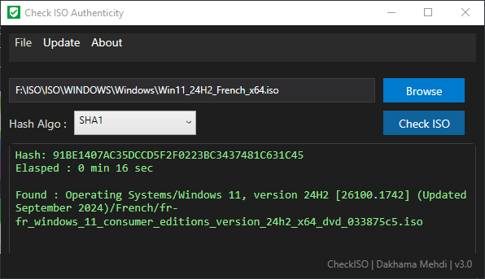
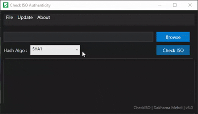

# CheckISO Trust your ISO before you deploy it.  

CheckISO is an open-source tool available as PowerShell script, standalone EXE, and Microsoft Store application.

It allows you to verify Microsoft installation sources and automatically calculate ISO hashes using trusted official libraries containing hundreds of known references.

<table>
<tr>
<td>

Supported sources include:

- Windows 10 / 11  
- Windows Server  
- SQL Server  
- Microsoft Office  
- And other Microsoft installation media  

</td>
<td>

</td>
</tr>
</table>

## Why CheckISO?

In every company, everything starts with a source. And that source is almost always an ISO.

Yet, it is one of the most overlooked elements in cybersecurity.

A compromised ISO can contain:

- Malware  
- Ransomware  
- Injected DLLs  
- Hidden backdoors  

Once deployed… it's already too late.

## The Problem

Today:

- ISO files are shared between teams  
- Stored on network drives  
- Downloaded from unverified sources  
- Reused for years  

With little to no verification.

## The Reality

An untrusted ISO can compromise:

- A full server  
- An Active Directory domain  
- An entire infrastructure  

## What CheckISO Does

In seconds, CheckISO allows you to:

- Automatically calculate hash (SHA256)  
- Identify the ISO  
- Verify it against trusted official sources  
- Detect inconsistencies or suspicious files  

CheckISO is designed to be The first control point for installation sources in enterprise environments

## Use Cases

- Validate ISO before deployment  
- Audit internal ISO repositories  
- Verify installation media integrity  
- Secure IT deployment workflows  

## Availability

- PowerShell (script)  
- Standalone EXE  
- Microsoft Store  

